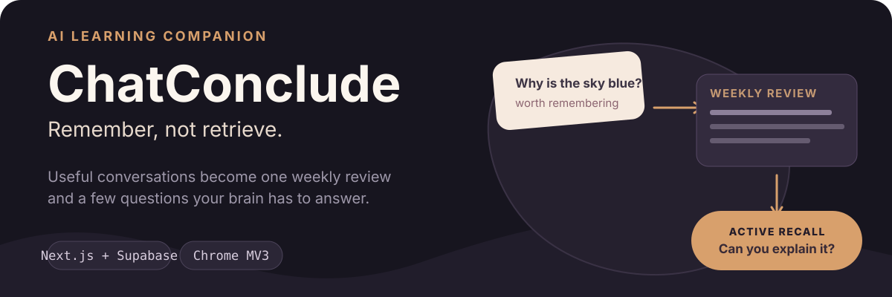
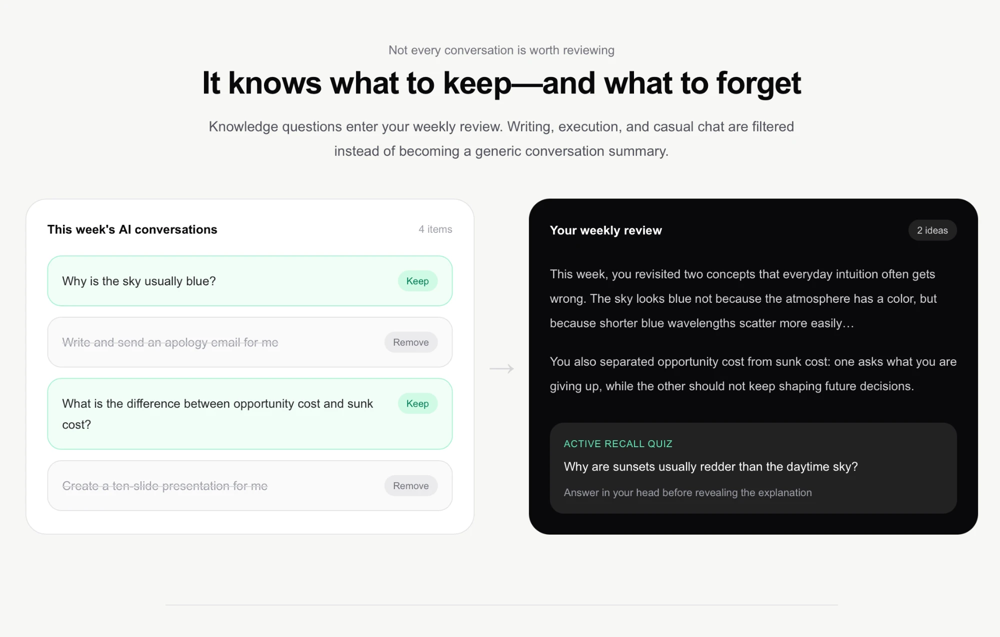
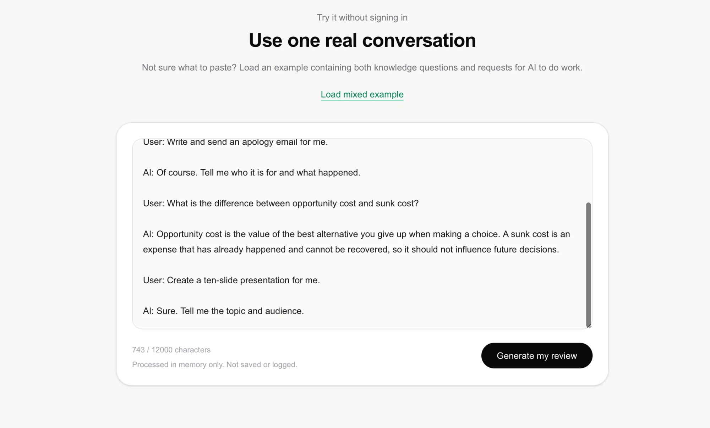

<p align="center">
  
</p>

<p align="center">
  <a href="https://chat-conclude.vercel.app"><strong>Try the stateless demo</strong></a>
  · <a href="./PRODUCT.md">Product notes</a>
  · <a href="./docs/CHROME_WEB_STORE.md">Extension guide</a>
</p>

<p align="center"><strong>English</strong> · <a href="./README.zh-CN.md">中文</a></p>

> You talk to AI dozens of times a week. A week later, how much of it do you
> actually still know?

Nothing to install — <https://chat-conclude.vercel.app> takes a pasted
conversation and returns a review. To run it locally:

```bash
git clone https://github.com/shenjiayi692-maker/chatconclude && cd chatconclude && cp .env.example .env.local && npm i && npm run dev
```

It starts and tells you which keys to set; the full flow needs Anthropic and Supabase.

ChatConclude helps you remember the useful things you ask AI. Save selected conversations from Claude, ChatGPT, or DeepSeek—or paste one into the web demo—and turn scattered learning into a readable weekly review with short active-recall questions.

## From conversation to memory

1. **Capture deliberately.** Save a conversation from the browser extension or paste it from any device.
2. **Filter the noise.** Knowledge questions stay; delegated work and casual chat are excluded.
3. **Read one coherent recap.** Related ideas become natural prose instead of a pile of summaries.
4. **Recall before rereading.** Each review ends with 3–5 questions that make you retrieve the idea yourself.

<p align="center">
  
</p>

## See it work

The public homepage is a no-account paste demo. Submit a conversation containing both things you learned and tasks you delegated; the result shows what entered the review, what was filtered, and the quiz that was generated.

<p align="center">
  
</p>

## Privacy by action

- The extension reads content only after you explicitly choose to save it and accept the disclosure.
- The public paste demo is request-scoped: it does not write the pasted conversation to the database or application logs.
- Signed-in data is isolated per user with Supabase row-level security.
- Source conversations are removed after weekly archiving; the generated review and quiz remain.
- Reviews are AI-generated and may contain omissions or errors.

See the full [privacy policy](https://chat-conclude.vercel.app/privacy) and [production checklist](./docs/PRODUCTION_CHECKLIST.md).

## Local development

```bash
cp .env.example .env.local
npm install
npm run dev
```

Configure the Anthropic and Supabase values listed in [`.env.example`](./.env.example), then validate changes with:

```bash
npm run lint
npm test
npm run build
```

## Architecture

| Layer | Implementation |
| --- | --- |
| Web app | Next.js 16 App Router, React 19, TypeScript, Tailwind CSS |
| Review engine | Anthropic SDK for classification, review writing, and quiz generation |
| Accounts and data | Supabase Auth, Postgres, SSR sessions, versioned migrations, RLS |
| Capture | Chrome Manifest V3 extension using DOM extraction—no private platform APIs |
| Delivery | Vercel with lint, tests, and build checks |

Primary routes are `/` for the stateless demo, `/app/capture` for saved conversations, `/app` for the current review, `/app/history` for archived reviews, and `/app/settings` for account and data controls.

The browser extension lives in [`extension/`](./extension/README.md). Run the SQL files in [`supabase/migrations/`](./supabase/migrations/) in filename order before deploying code that depends on them.

## Status

- Web paste demo: available now
- Account capture, review history, export, and deletion: implemented
- Chrome extension: packaged for manual installation and store submission
- Scheduled email delivery and share-to-capture: planned

The extension capture layer builds on [TheBluCoder/AI-chat-exporter](https://github.com/TheBluCoder/AI-chat-exporter) under MIT; see [`THIRD_PARTY_NOTICES.md`](./THIRD_PARTY_NOTICES.md).
